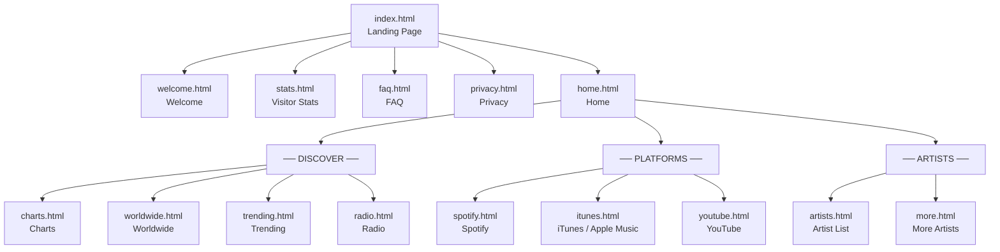
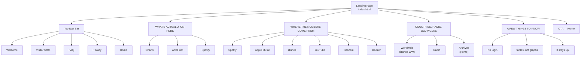

# Kworb Navigation Diagram

Full site navigation flow — from the **Landing Page** entry point through **Home**, then out to every section and sub-page.

---

## Site Flow

---

## Landing Page — Section Map

The landing page is structured into four named content sections, plus the top nav bar.

---

## Full Page Inventory

### Landing (`/`)
| File | Page |
|---|---|
| `index.html` | Landing Page |

### Site Info (`/pages/site/`)
| File | Page |
|---|---|
| `welcome.html` | Welcome |
| `stats.html` | Visitor Stats |
| `faq.html` | FAQ |
| `privacy.html` | Privacy |

### Home (`/pages/`)
| File | Page |
|---|---|
| `home.html` | Home / Dashboard |

### Discover (`/pages/discover/`)
| File | Page |
|---|---|
| `charts.html` | Charts |
| `worldwide.html` | Worldwide (iTunes WW) |
| `trending.html` | Trending |
| `radio.html` | Radio |
| `albums.html` | Albums |
| `apple-songs.html` | Apple Music Songs |
| `apple-albums.html` | Apple Music Albums |
| `apple-eu-songs.html` | Apple Music EU Songs |
| `apple-eu-albums.html` | Apple Music EU Albums |
| `itunes-albums.html` | iTunes Albums |
| `itunes-eu-songs.html` | iTunes EU Songs |
| `itunes-eu-albums.html` | iTunes EU Albums |

### Platforms (`/pages/platforms/`)
| File | Page |
|---|---|
| `spotify.html` | Spotify |
| `itunes.html` | iTunes / Apple Music |
| `youtube.html` | YouTube |
| `youtube-artists.html` | YouTube Artists |
| `youtube-countries.html` | YouTube Countries |
| `youtube-toplists.html` | YouTube Top Lists |
| `itunes-uk.html` | iTunes UK |
| `itunes-au.html` | iTunes AU |
| `itunes-ca.html` | iTunes CA |
| `itunes-de.html` | iTunes DE |
| `itunes-fr.html` | iTunes FR |
| `itunes-jp.html` | iTunes JP |
| `itunes-br.html` | iTunes BR |
| `itunes-mx.html` | iTunes MX |
| `itunes-es.html` | iTunes ES |
| `itunes-it.html` | iTunes IT |
| `itunes-nl.html` | iTunes NL |
| `itunes-be.html` | iTunes BE |
| `itunes-ch.html` | iTunes CH |
| `itunes-ie.html` | iTunes IE |
| `itunes-nz.html` | iTunes NZ |
| `itunes-ru.html` | iTunes RU |
| `itunes-tr.html` | iTunes TR |
| `itunes-za.html` | iTunes ZA |

### Artists (`/pages/artists/`)
| File | Page |
|---|---|
| `artists.html` | Artist List |
| `more.html` | More Artists |
